# XiaoMiao Player - Local Anime Video Real-time Upscaling Player

**[中文版本](README.md) | [English Version](README_EN.md)**

An Android local video player based on libmpv. The core feature is the open-source implementation of Anime4K real-time upscaling algorithm, optimized for anime/animation/bangumi video styles, significantly enhancing the viewing experience of low-resolution anime.

Also supports danmaku, subtitles, gesture controls, Bilibili bangumi online playback, and other features, and can be used as a general-purpose local video player.

## 📑 Table of Contents

### 📋 Project Information
- [License](#license) - Open Source License
- [⚠️ Important Notice](#️-important-notice) - Usage Guidelines

### 🚀 Getting Started
- [Quick Start](#quick-start) - Download & Install
- [Features](#features) - Core Features
- [Screenshots](#screenshots) - App Interface Preview

### 🔧 Technical
- [Technical Architecture](#technical-architecture) - Tech Stack
- [Acknowledgments](#acknowledgments) - Open Source Credits

### 🔒 Privacy & Documentation
- [Privacy & Third-Party Services](#privacy--third-party-services) - Privacy Policy & API Info
- [Technical Documentation](#technical-documentation) - Complete Technical Docs Index
- [Feedback & Suggestions](#feedback--suggestions) - Issue Reporting

---

## License

> [!IMPORTANT]
> This project is licensed under [GPL-3.0-or-later](LICENSE) and is free and open source.
> 
> **Any form of redistribution must remain open source, follow the same license, and retain the original author and copyright information.**

---

## ⚠️ Important Notice

**This project is intended for learning and testing purposes only. Please do not abuse it!**

We strongly oppose and do not condone any form of piracy, illegal distribution, dark web activities, or other illegal uses or behaviors.

- Any consequences arising from the use of this project (including but not limited to illegal purposes, account restrictions, or other losses) shall be borne by the user personally and have nothing to do with [me](https://github.com/azxcvn). I am not responsible.
- This project is **free and open source**, and the author has not obtained any economic benefits from it.
- This project does not bypass authentication mechanisms, crack paid resources, or engage in other illegal activities.
- "哔哩哔哩" and "Bilibili" names, logos, and related graphics are registered trademarks or trademarks of Shanghai Huandian Information Technology Co., Ltd.
- This project is an independent third-party tool and has no affiliation, cooperation, authorization, or endorsement with Bilibili or its affiliated companies.
- Content obtained using this project is copyrighted by the original rights holders. Please comply with relevant laws, regulations, and platform service agreements.
- If there is any infringement, please feel free to [contact](https://github.com/azxcvn) for resolution.

---

## Quick Start

📥 **Download**: [GitHub Releases](https://github.com/azxcvn/mpv-android-anime4k/releases)

> **Requirements**: Android 12 (API 31) or higher, 8GB+ RAM recommended

---

## Features

### Core Features

- 🎬 **Video Playback**: Supports mainstream formats (MP4, MKV, AVI, etc.)
- 🌐 **Web Sniffing**: Built-in WebView to sniff and play web videos
- 📺 **Bilibili**: Login, online streaming, video/bangumi download
- ☁️ **WebDAV**: Connect to cloud servers, stream network videos
- 📂 **Playlists**: Auto scan, sort, and categorize
- 📝 **Subtitles**: Embedded/external subtitles, auto-load, style adjustment
- 🔊 **Audio**: Multi-track switching, volume boost (0.1% precision)
- 💬 **Danmaku**: DanDanPlay matching, Bilibili danmaku download, style customization
- 👆 **Gestures**: Brightness, volume, progress control, customizable
- 🎨 **Upscaling**: Anime4K real-time video upscaling
- 🖼️ **Others**: Screenshot saving, playback progress memory

📖 **Full Feature Documentation**: [Feature Details](docs/features.md)

---

## Screenshots

## Key Features

- **Video Playback**: Support for mainstream video formats (MP4, MKV, AVI, etc.)
- **Web Sniffing Feature**: Built-in WebView for sniffing web videos, automatically selecting the best quality, and one-click playback
- **Bilibili Bangumi Support**: Login to Bilibili account, stream bangumi online (see [Login Implementation](docs/bilibili_login.md) and [Bangumi Parsing Principle](docs/bilibili_bangumi.md))
- **Bilibili Video/Bangumi Download**: Download Bilibili videos and bangumi to local storage (see [Download Implementation Principle](docs/bilibili_download_principle.md))
  - Support for full URLs, short links (b23.tv), and text-embedded share links
  - Automatic video information parsing, support for multi-episode bangumi selection
  - Automatic audio-video merging into MP4 format
  - Support for pause, resume, and cancel downloads
  - Real-time download progress display
  - ⚠️ **For personal learning use only, commercial use is strictly prohibited**
📖 **Full Feature Documentation**: [Feature Details](docs/features.md)

---

## Screenshots

### 📱 Application Interface (Portrait)

| Home | Video List | Bangumi | Web Sniffing |
|------|------------|---------|--------------|
| 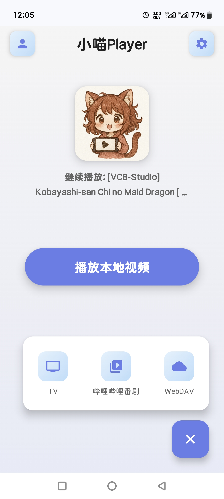 | 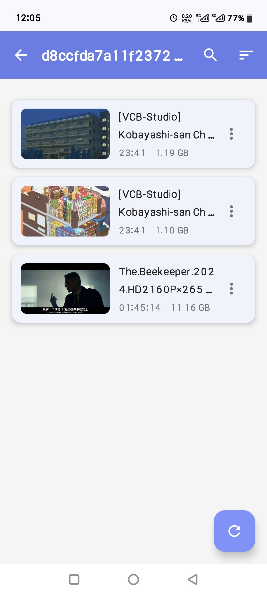 | 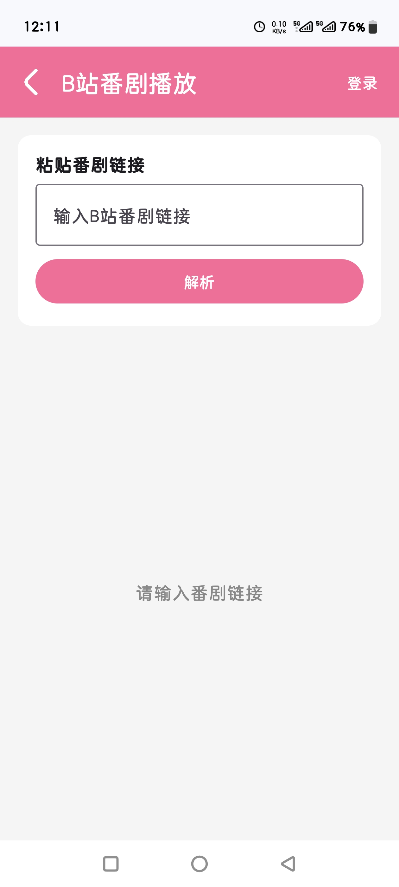 | 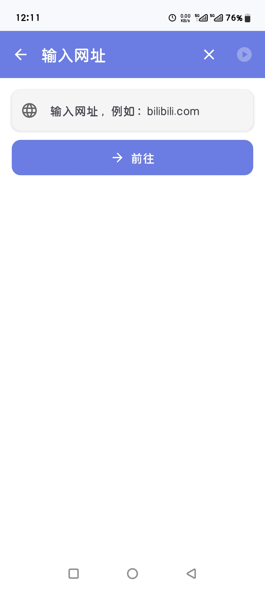 |

| WebDAV | WebDAV Details | Settings 1 | Settings 2 |
|--------|----------------|------------|------------|
| 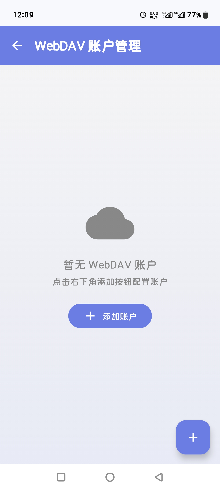 | 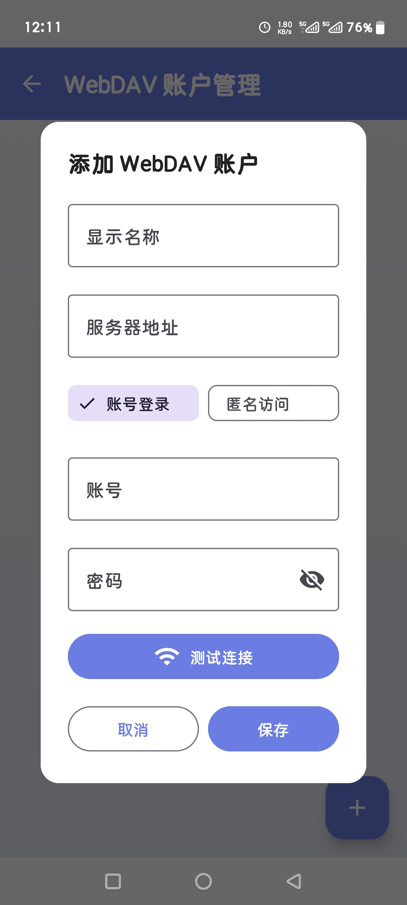 | 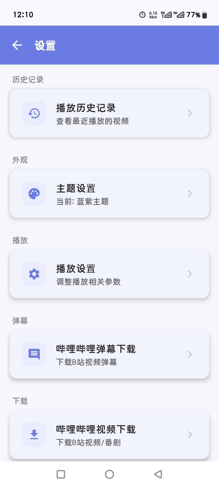 | 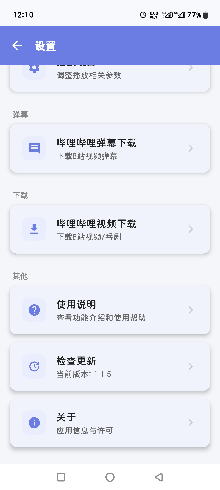 |

### 🎬 Player Interface (Landscape)

| Player | Danmaku | Danmaku Settings | Subtitle Settings |
|--------|---------|------------------|-------------------|
| 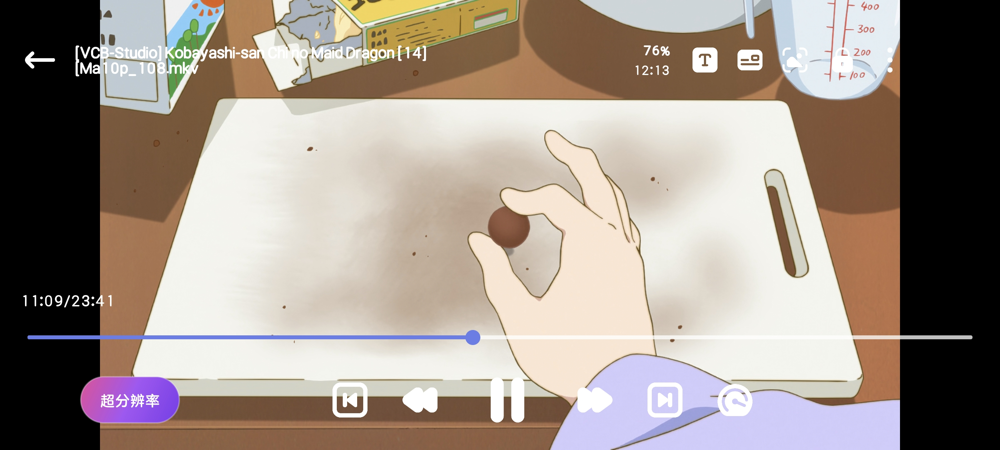 |  |  | 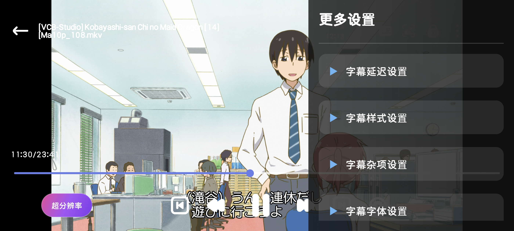 |

| Progress | Resume Play | More Menu | Upscaling |
|----------|-------------|-----------|-----------|
| 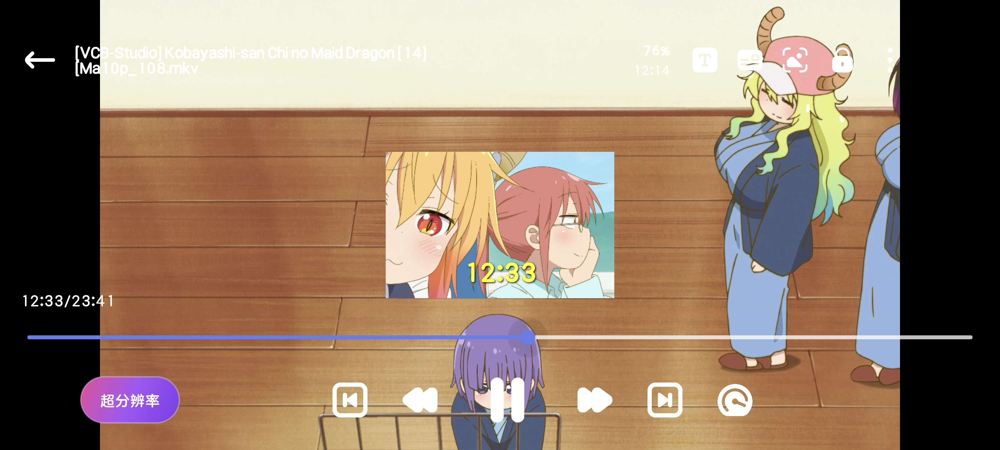 | 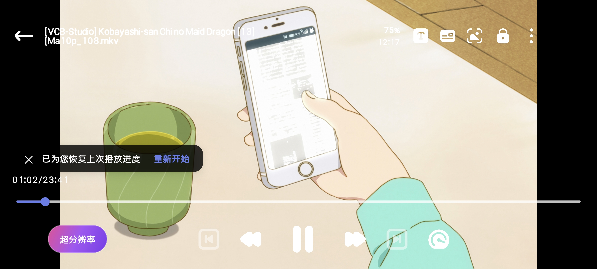 | 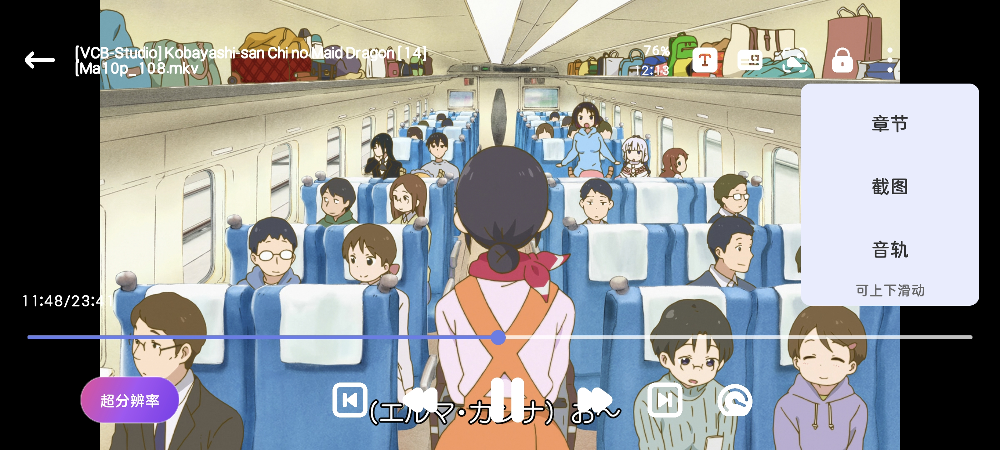 | 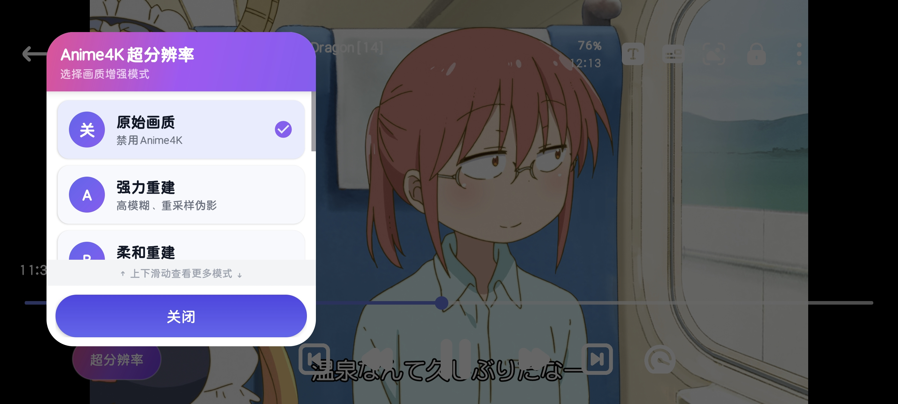 |

---

## Technical Architecture

- **Video Engine**: libmpv (open-source multimedia player library)
- **UI Framework**: Android AppCompat
- **Programming Languages**: Kotlin + Java
- **Minimum SDK**: 28 (Android 9.0)
- **Compile SDK**: 34 (Android 14)

## Acknowledgments

This project would not be possible without the contributions of the following open-source projects and developers!

### 🏗️ Core Foundation

The following projects provide core technical support for this application:

- **[mpv-player/mpv](https://github.com/mpv-player/mpv)**  
  The core foundation of this project, a powerful open-source multimedia player library

- **[mpv-android/mpv-android](https://github.com/mpv-android/mpv-android)**  
  Android platform porting reference

- **[abdallahmehiz/mpv-android](https://github.com/abdallahmehiz/mpv-android/releases)**  
  Provides ready-to-use libmpv precompiled library files

- **[bilibili/DanmakuFlameMaster](https://github.com/bilibili/DanmakuFlameMaster)**  
  Bilibili's open-source Android danmaku engine, the core of this project's danmaku functionality

### 🔧 Algorithms & Feature Implementation

The following projects provided important references for the implementation of this application's features:

- **[bloc97/Anime4K](https://github.com/bloc97/Anime4K)**  
  Real-time upscaling algorithm, provides GLSL shader files

- **[marlboro-advance/mpvEx](https://github.com/marlboro-advance/mpvEx)**  
  Referenced sliding algorithms and overall interaction logic

- **[abdallahmehiz/mpvKt](https://github.com/abdallahmehiz/mpvKt)**  
  Referenced gesture controls, external subtitle import, and other implementations

- **[xyoye/DanDanPlayForAndroid](https://github.com/xyoye/DanDanPlayForAndroid)**  
  Referenced danmaku system architecture, WebDAV functionality implementation, and many other features

- **[the1812/Bilibili-Evolved](https://github.com/the1812/Bilibili-Evolved)**  
  Referenced concurrent optimization strategies for danmaku download and API calling methods

- **[btjawa/BiliTools](https://github.com/btjawa/BiliTools)**  
  Referenced the implementation principles of Bilibili video/bangumi download

- **[qiusunshine/hikerView](https://github.com/qiusunshine/hikerView)**  
  Referenced web video sniffing functionality and anti-sniffing algorithm logic

### 🌐 API Services & Documentation

Thanks to the following projects for providing API services and technical documentation:

- **[DanDanPlay](https://www.dandanplay.com/)**  
  Provides danmaku matching API service, supports intelligent matching and downloading of danmaku for local videos

- **[wyziedevs/wyzie-subs](https://github.com/wyziedevs/wyzie-subs)**  
  Provides subtitle search API service, supports online searching and downloading of subtitle files for movies and TV shows

- **[SocialSisterYi/bilibili-API-collect](https://github.com/SocialSisterYi/bilibili-API-collect)**  
  Collected and organized Bilibili's public APIs, provided valuable API reference documentation for this project

### 💡 Inspiration

- **[Predidit/Kazumi](https://github.com/Predidit/Kazumi)**  
  The original inspiration and requirements for this project

### 🎨 Assets

- **App Icon**: Generated by AI
- **Player Control Icons**: From [FLATICON](https://www.flaticon.com/)
- **Other UI Icons**: Material Icons (provided by Google, follows Apache License 2.0)

---

**Special thanks to all the open-source projects and developers above!** Without your open-source contributions, this project would not exist.

---

## Privacy & Third-Party Services

### Privacy Statement

- Does not collect any personal information
- Does not upload any data to servers
- All features run locally on device
- Project is completely open source, code is auditable

### Third-Party APIs

Uses Bilibili and DanDanPlay public API services for bangumi playback and danmaku matching.

API Details: [Third-Party API Documentation](docs/third_party_api.md)

### Data Security

Login credentials are encrypted with AES-256 and stored locally on device, not uploaded to any servers.

Security Details: [Data Security Documentation](docs/data_security.md)

### Permissions

The app requests the following permissions:

- Storage Permission (Manage All Files): Read and save local videos, subtitles, and danmaku files
- Network Permission: Bilibili bangumi streaming, danmaku downloads, and video downloads (user-initiated)

---

## Technical Documentation

- **[Project Build Guide](docs/development_guide.md)** - Project build and DanDanPlay API configuration tutorial
- **[.nomedia Support](docs/nomedia_support.md)** - .nomedia file handling mechanism
- **[WebDAV Usage Guide](docs/webdav使用说明.md)** - WebDAV configuration and usage tutorial
- **[Third-Party API Documentation](docs/third_party_api.md)** - Detailed list of third-party APIs used
- **[Data Security Documentation](docs/data_security.md)** - Data encryption and security mechanism
- **[Bilibili Login Mechanism](docs/bilibili_login.md)** - Bilibili login flow and implementation
- **[Bilibili Bangumi Parsing](docs/bilibili_bangumi.md)** - Bangumi parsing and playback implementation
- **[Bilibili Danmaku Download](docs/bilibili_danmaku_download.md)** - Danmaku download algorithm and optimization
- **[Bilibili Download Principle](docs/bilibili_download_principle.md)** - Video/bangumi download implementation
- **[Bilibili Security Analysis](docs/bilibili_security_analysis.md)** - Anti-crawler and security mechanism analysis

---

## Feedback & Suggestions

Encountered an issue or have improvement suggestions? Welcome to provide feedback through the following channels:

- 💡 **Feature Suggestions & Feedback**: [Submit an Issue](https://github.com/azxcvn/mpv-android-anime4k/issues)
- 📧 **Contact Author**: [GitHub Profile](https://github.com/azxcvn)

---

**Last Updated:** 2026-04-02
